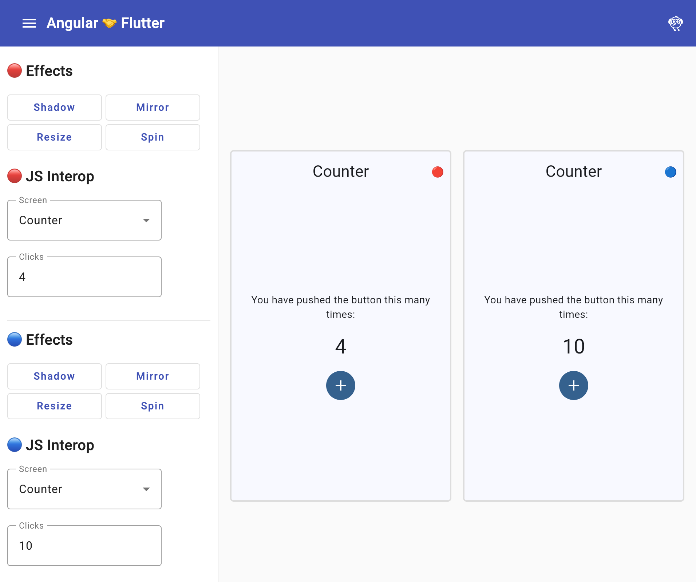

# ng-flutter

This Angular project demonstrates how to embed and interoperate Flutter web apps within an Angular application. It supports **multiple Flutter views** side-by-side and bidirectional state sync between Angular and Flutter via JavaScript interop.

The demo renders two Flutter instances (🔴 and 🔵) with a shared sidebar to control screens (Counter, TextField, Custom App), visual effects (Shadow, Mirror, Resize, Spin), and JS interop (screen, clicks, text). See [flutter/README.md](flutter/README.md) for Flutter-side details.



## Points of Interest

### Angular

This is a standard Angular app with these additions for Flutter web integration:

* **`package.json`** has a custom `prebuild` script that builds the Flutter web app before the Angular build so the output is available.
* **`flutter_bootstrap.js`** is added as a `"scripts"` entry in `angular.json`. This script (generated by `flutter build web`) provides the necessary environment to bootstrap the Flutter engine and is injected into the app.
* The Flutter output (`flutter/build/web/`) is registered as an `"assets"` entry in `angular.json` and served under `/flutter`.
* The **`ng-flutter`** component embeds Flutter web and uses multi-view support (`multiViewEnabled: true`) with `addView` / `removeView` so multiple Flutter instances can run in parallel.
* The component yields control to Angular via an `appLoaded` `EventEmitter`. The payload is a state controller exposed by Flutter through a `flutter-initialized` custom event.

### Flutter

The embedded Flutter app lives in the `flutter` directory. It is a standard Flutter web project designed to be embedded (not run standalone) and does not depend on Angular.

* Flutter uses **`@JSExport()`** and **`createJSInteropWrapper`** from `dart:js_interop` to expose state to JavaScript.
* **`DemoAppStateManager`** (in `lib/src/js_interop/`) is exported to JS so Angular can read/write screen, counter, and text.
* **`broadcastAppEvent`** dispatches a custom event on the host DOM element so Angular receives the state controller when each view initializes.

## How to Build the App

### Requirements

You need a recent Angular toolchain:

```console
$ ng version

Angular CLI: 21.1.x (or compatible)
Node: 20.x or 24.x
Package Manager: npm
```

And Flutter:

```console
$ flutter --version

Flutter 3.x or later • channel stable
Dart 3.6.0 or later
```

Ensure `npm`, `ng`, and `flutter` are in your `$PATH`.

### Building the App

1. Install npm dependencies:

```console
$ npm install
```

2. Run the `build` script (Flutter is built automatically via the `prebuild` script):

```console
$ npm run build
```

### Local Angular Development

```console
$ npm run start
```

This starts the dev server.

Open http://localhost:4200/. The app will reload when Angular source files change.

### Local Flutter Web Development

The Flutter project is in the `flutter` directory and can be developed on its own, but it cannot be run standalone. `flutter/web/index.html` is minimal and only needed so `flutter build web` works.

Angular does not watch Flutter sources. **After changing the Flutter project, run `npm run build` to rebuild everything.**

### Deploying the App

After `npm run build`, deploy the contents of `dist/ng-flutter` to any static hosting service.

## Troubleshooting

### Flutter Build Missing

If you see errors like:

```
Error: Can't resolve 'flutter/build/web/flutter_bootstrap.js' in '...'
```

Run `npm run build` so the Flutter web build completes before the Angular build.

### Angular Change Detection with Flutter

Flutter events (e.g. counter clicks) do not trigger Angular change detection. The app uses `ChangeDetectorRef.detectChanges()` when Flutter notifies Angular via callbacks like `onClicksChanged` and `onTextChanged`.
